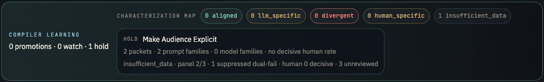

# Hamlet's Ghost

Hamlet's Ghost is a comparative-judgment instrument for characterizing LLM aesthetic preference.



Its job is not just to generate outputs. Its job is to discover which model voices produce panel-preferred artifacts, where automated judges disagree, and how those preferences compare with human review.

The core external value to watch for is simple:

> visibility into which AI output a panel prefers when multiple answers look plausible.

The lab is designed to answer a sharper internal question:

> Which artifacts do humans prefer when machines disagree, and what does that reveal about panel preference, human alignment, and evaluator drift?

This is not a prompt playground and not yet a product in itself. It is a research instrument with:
- a generation layer
- an evaluation layer
- explicit comparison packets
- disagreement tracking
- provenance and audit history
- human judgment as the characterization reference
- a reflective judgment wiki
- a compiled taste taxonomy
- evaluator characterization memory

The lab is the engine. If a product emerges, it will likely be the judgment capability that falls out of the engine rather than the lab ontology itself.

## Current Role Stack

- `GENESIS`: default internal generator
- `Theron`: paired external generator inside the lab packet flow
- `MUSE`: internal evaluator and continuity anchor
- `ATHENA`: internal skeptical evaluator lane
- `APOLLO`: external evaluator lane
- `human operator`: characterization reference and external-action authority

External agents are meant to increase creative tension and useful disagreement, not take uncontrolled ownership of the lab.

## What Hamlet's Ghost Is

Hamlet's Ghost exists to make judgment more legible and more testable.

Its core unit is intentionally simple:
1. prompt in
2. rival outputs out
3. judges vote
4. human review supplies a comparison signal
5. panel-preference finding stored

That is the loop the lab is trying to refine.

The loop now leaves behind three distinct memory layers:
- SQLite as the operational record
- `wiki/` as reflective, revisable judgment memory
- `taxonomy/` and `calibration/` as distilled research outputs

Inside `wiki/`, the reflective layer now also maintains:
- lesson and evaluator revision histories
- filed council memos as durable research memory
- a generated lint surface for stale, weak, or under-evidenced judgment memory

## What It Is Not

Hamlet's Ghost is not:
- a general-purpose multi-agent platform
- a claim that quality has become objective
- a grand ontology of agents and statuses for its own sake
- a UI-first product whose value depends on dashboards

Its value lives in the accumulating corpus of comparative judgments:
- machine vs machine
- judge vs judge
- machine judgment vs human judgment

That corpus is the likely moat. Everything else is scaffolding.

## What The Lab Does

The backend runs experiments on tasks in two lanes:
- `creative`
- `business`

Each task includes:
- a prompt
- constraints
- a prompt family
- a hypothesis

The prompt corpus is now stored as structured local data in [data/prompt_library.json](data/prompt_library.json), then loaded and scheduled by [experiments.py](experiments.py). The current corpus includes 100 prompts across creative and business lanes, so the lab can broaden its testing without constant prompt-generation API spend.

For each packet or experiment, the lab:
1. selects a task
2. generates one or more artifacts
3. scores them with evaluators
4. records provenance, disagreement, traces, and scores
5. routes the interesting disagreements to human review
6. stores the resulting judgment as reusable characterization memory

The long-form operating protocol lives in [program.md](program.md).

## Repo Map

- [server.py](server.py): FastAPI app, scheduler, experiment execution, API surface
- [agents.py](agents.py): generation and evaluation role routing
- [database.py](database.py): SQLite schema, persistence, analytics helpers
- [experiments.py](experiments.py): prompt library loader, policy variants, scheduling logic
- [judgment_wiki.py](judgment_wiki.py): compiler for the judgment wiki, compiled taxonomy, and evaluator characterization outputs
- [data/prompt_library.json](data/prompt_library.json): versioned local prompt corpus used for experiments
- [data/taste_memory.json](data/taste_memory.json): seeded preference vocabulary for anti-patterns, quality signals, and evaluator failure modes
- [wiki/memos](wiki/memos): filed council memos and synthesized research notes that should not disappear into chat history
- [wiki/lint/latest.md](wiki/lint/latest.md): generated sanity pass over weak or under-evidenced memory surfaces
- [taxonomy/compiled_taxonomy.json](taxonomy/compiled_taxonomy.json): machine-readable panel-preference findings promoted from repeated evidence
- [calibration/index.md](calibration/index.md): evaluator characterization summary compiled from human-reviewed packets
- [program.md](program.md): research protocol and operating model
- [docs/judgment-wiki.md](docs/judgment-wiki.md): architecture for reflective memory, taxonomy promotion, and characterization outputs
- [docs/backend-safety-protocol.md](docs/backend-safety-protocol.md): required safety posture for backend work
- [docs/hermes-trust-model.md](docs/hermes-trust-model.md): staged authority model for agents
- [docs/external-agent-rollout.md](docs/external-agent-rollout.md): rollout plan for Theron/OpenClaw and external Hermes

## Running The Lab

Start the backend:

```bash
cd hamlets-ghost
./start.sh
```

Default host and port:
- `127.0.0.1:7777`

Useful API endpoints:
- `GET /api/state`
- `GET /api/history`
- `GET /api/analysis`
- `GET /api/providers`
- `GET /api/review/disagreements`
- `GET /api/review/reason-tags`
- `GET /api/artifact/{id}`
- `POST /api/start`
- `POST /api/stop`
- `POST /api/experiment/custom`
- `POST /api/experiment/external`
- `POST /api/experiment/paired`

## Safety Before Speed

This lab was recovered after a backend corruption incident. Because of that, reversibility is part of the operating model.

Before risky backend changes:
- run preflight
- keep work scoped to one change family at a time
- checkpoint in git
- avoid broad rewrites of core modules

Run preflight with:

```bash
cd hamlets-ghost
bash scripts/preflight.sh
```

See [docs/2026-04-02-backend-recovery-incident.md](docs/2026-04-02-backend-recovery-incident.md) for the incident record and [docs/backend-safety-protocol.md](docs/backend-safety-protocol.md) for the live protocol.

## Theron's Place In The Lab

Theron is being integrated as a bounded external generation partner, not as an uncontrolled backend owner.

Current intended posture:
- read the repo
- understand the lab's aims and architecture
- participate first through bounded generation or proposal workflows
- earn broader authority through characterized reliability and safe operation

For now, the cleanest manual bridge is:
1. build a Theron request packet
2. send it to Theron
3. bring the artifact back through the external experiment endpoint
4. let the local lab score and store it

Generate a Theron-ready packet with:

```bash
cd hamlets-ghost
./.venv/bin/python scripts/build_theron_packet.py --task-id c08
```

This keeps the lab core local while still allowing Theron to participate meaningfully.

## Working Agreement For Agents

If you are an agent reading this repo, assume:
- the source tree must remain recoverable
- human judgment is still the characterization reference
- promotion logic, storage, and external authority stay local unless explicitly widened
- ambition is welcome, but it must be paired with reversibility

The lab wants genuine disagreement, strong generations, and disciplined iteration.

## Status

The lab is currently:
- recovered
- under git
- test-backed
- running locally
- operating as a bounded comparative judgment engine

That means it is ready for serious experimentation, but not for careless autonomy or premature productization.
